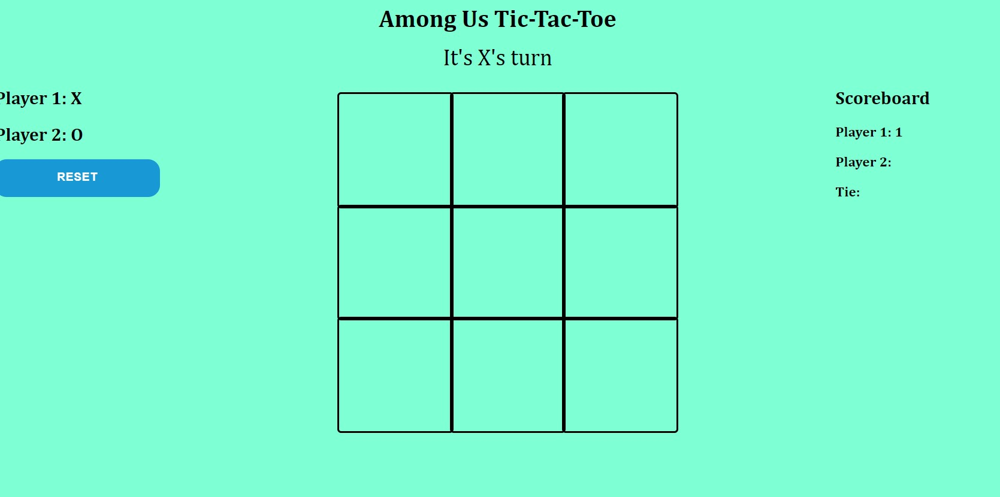

# TicTacToe Game

An application to play a classic game of Tic-Tac-Toe against a friend.

## Current Features
- Users can play a game vs another user
- Users can click a square on the boad and their character will appear
- Users can see how many times that have won or tied

 ## Technologies Used
 - Javascript
 - CSS
 - HTML

 ## Installation Instructions

- Link to website to play https://practical-mccarthy-6b31da.netlify.app

## Contribute
 - Refrences
 https://dev.to/bornasepic/pure-and-simple-tic-tac-toe-with-javascript-4pgn

https://www.youtube.com/watch?v=B3pmT7Cpi24&ab_channel=JavaScriptAcademy

http://jsfiddle.net/6qkdP/2/

- Where I got my sound

https://www.zapsplat.com/?s=pop&post_type=music&sound-effect-category-id=